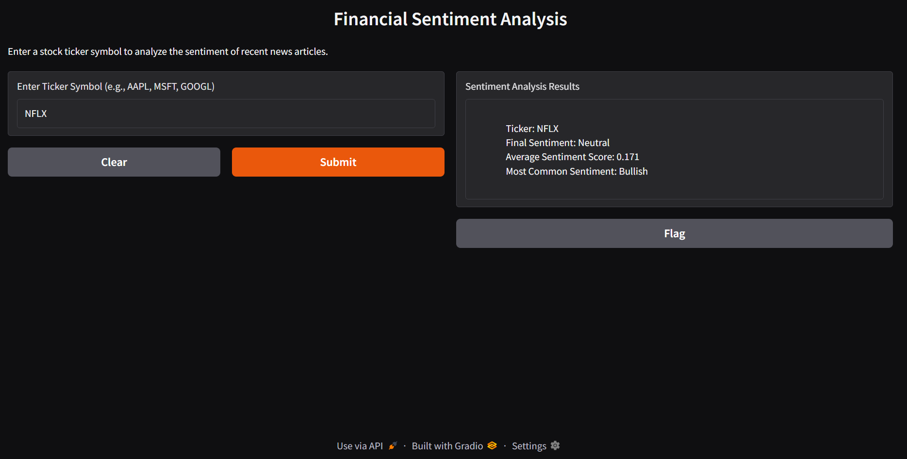

# Financial_Sentiment_Analysis
A financial statement analysis using Natural Language Understanding.

I have made an attempt to develop a fastapi based on a ngnix server suitable to be deployed in a production environment for scalabilty and load balancing. On top of this there is an interactive gradio chatbot interface enabling the user to query the required ticker.

## Setup

### Create a Conda environment

```sh
conda create -n chatbot python=3.10.15
```
### Get all the dependencies
Install all the required dependencies by activating the chatbot environment.
```sh
pip -r install requirements.txt
```
NOTE : 
1. I have configured the pipeline to utilize CPU-based inference to ensure seamless execution, mitigating potential compatibility issues between the CUDA version and Torch. This approach guarantees that the invigilator can run the container without any disruptions.

2. The FMP and Finnhub API keys to fetch latest news and summary were paid and needed subscription. As a result I used only the Alpha Vantage API to get the required information.

3. Normally, the .env file would be included in the .gitignore to ensure the credentials are stored securely. However, in this case, it has been intentionally included to simplify the setup process for the invigilator, as the token used is freely available and does not pose a security risk. The env file is not copied inside the docker build for the fastapi container but is referenced by the docker compose and uses this in its network as a environment variable making the network more secure to attacks.

### Activate the app
```sh
python app.py
```
### Query a Ticker
After the app gets activated you may connect to the app by querying the required ticker at the following address.Replace the ticker attribute with the company ticker you want to enquire.
```sh
http://localhost:8000/api/v1/sentiment?ticker=AAPL
```

## Building and Running the Docker Image
Make sure you have docker desktop installed on your platform. If not download it from [here](https://www.docker.com/products/docker-desktop/).

To build the docker image go to the workspace containing the Dockerfile and run the following command:
```sh
docker-compose build
```

Make sure your .env file exists in the same directory and contains your API key:
```sh
ALPHA_VANTAGE_API_KEY=your_api_key_here
```

To create and run the containers out of the images
```sh
docker-compose up -d
```
Note that I have set the environment in Windows OS and run the commands 

To test if the API is running correctly, you can use curl (or a web browser):
```sh
curl http://localhost:8000/
```

To test the sentiment analysis endpoint:
```sh
curl http://localhost:8000/api/v1/sentiment?ticker=AAPL
```

## Run the gradio chatbot interface
To run the interactive chatbot interface, first of all install gradio in the chatbot conda environment using:
```sh
pip install gradio requests
```
Following this run the following command in the terminal to activate the chat interface.
```sh
python gradio_interface.py
```

